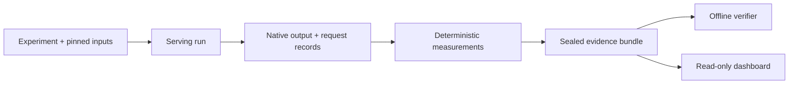

# Inferdrome

**Turn an LLM-serving run into evidence someone else can check.**

Inferdrome pins an experiment, captures the benchmark's native output, reduces
request-level observations into reproducible measurements, and seals the result
for offline verification. The local dashboard lets you trace a measurement
back to its run and evidence. ExitSpec remains the separate customer acceptance
authority.



## What you can inspect

- **A reproducible run:** resolved inputs, pinned runtime and model identities,
  complete request accounting, and the benchmark's untouched output.
- **A checked result:** deterministic reduction, exact-byte manifests, and an
  independent offline verifier. Missing observations stay missing.
- **A readable trail:** the local dashboard connects measurements, routing
  decisions, outcomes, and evidence without changing the underlying bundle.

## Measured on two A100s

A later, manually hosted Qwen3-8B study used **two independent vLLM 0.26
replicas**, one per A100-SXM4 40 GB GPU. Four routing policies saw matched
synthetic traffic. The studies are descriptive; they do not establish a
production routing winner.

| Study | What happened |
| --- | --- |
| Routing baseline | **21,300/21,300 requests completed:** 2,100 calibration and 19,200 evaluation. All four policies tied at **4.000 SLO-good requests/s** at the selected 4 requests/s rate. |
| Separate capacity sweep | Across four matched blocks at 6 offered requests/s, cache-only averaged **5.633** versus least-busy **5.254 SLO-good requests/s** (**+7.2%**). Every policy missed the sweep's 95% pass rule at that rate. |

Read the [method, source revisions, calculations, and limitations](docs/VLLM_ROUTER_RESULTS.md).
The private raw archives are not published.

## Try the local walkthrough

Requires Python 3.12 and [`uv`](https://docs.astral.sh/uv/). From the repository root:

```bash
uv sync --frozen --extra dev --extra dashboard
./scripts/run_local_demo.py
```

This creates and verifies a **synthetic** two-endpoint campaign, then opens the
read-only dashboard on loopback. It demonstrates the evidence workflow and does
not replay the GPU studies. See the [demo guide](docs/LOCAL_DEMO.md) for the
screens and controls.

## Find your way around

| If you want to… | Start here |
| --- | --- |
| Understand the pipeline | [Architecture](docs/ARCHITECTURE.md) and [product charter](docs/PRODUCT.md) |
| Use the CLI and evidence bundles | [CLI guide](docs/CLI.md) and [bundle verification](docs/EVIDENCE_BUNDLE_V1.md) |
| Explore routing reversals | [Breakpoint: search, reduce, confirm](docs/BREAKPOINT.md), with a GPU-free walkthrough |
| Examine the GPU studies | [Two-replica results](docs/VLLM_ROUTER_RESULTS.md) and [real-GPU proof](docs/REAL_GPU_PROOF.md) |
| Review release scope | [v0.2 contract](docs/V0_2_CAPABILITIES.md), [v0.3 contract](docs/V0_3_CAPABILITIES.md), and [detailed project notes](README_DETAILS.md) |

The v0.2/v0.3 contracts describe their historical release boundaries. The
later two-A100 manual-host study does not turn the separate GCP guarded
campaign or Kubernetes production operation into an executed claim. The
dashboard is local and read-only; it was outside the v0.1 release gate.
Cloud examples remain dry-run/reference.
Inferdrome produces measurements. ExitSpec owns customer acceptance.

Repository-authored code is [Apache-2.0 licensed](LICENSE). Model weights,
workloads, generated output, and private evidence have separate terms.
