# Inferdrome architecture

Status: **Normative for v0.1; public schemas frozen; post-v0.1 comparison execution accepted**

## System shape

```mermaid
flowchart LR
    A["Source experiment specification"] --> B["Resolver"]
    B --> C["Resolved specification"]
    B --> D["Frozen request plan"]
    C --> E["Run orchestrator"]
    D --> E
    E --> F["Target preflight"]
    E --> G["Benchmark adapter"]
    G --> H["Pinned vLLM bench serve"]
    H --> I["Attached endpoint"]
    H --> J["Untouched native artifacts"]
    J --> K["Version-specific normalizer"]
    K --> L["Canonical request records"]
    L --> M["Deterministic reducer"]
    M --> N["Derived measurements"]
    C --> O["Evidence bundle writer"]
    D --> O
    J --> O
    L --> O
    N --> O
    O --> P["Offline integrity verifier"]
    P --> Q["Sealed evidence bundle"]
    Q --> R["ExitSpec importer"]
    R --> S["Independent recalculation"]
    S --> T["PASS / FAIL / NOT_PROVEN"]
    Q --> U["Local dashboard bundle reader"]
    U --> V["Verification and Python recalculation"]
    V --> W["Bounded read-only projections"]
    W --> X["Runs / Detail / Compare / Evidence"]
    Q --> Y["Trial Set creator / verifier"]
    Y --> Z["Immutable Trial Set descriptor"]
    Z --> AA["Equal-per-run descriptive summary"]
    AA --> W
```



## Architectural layers

### Deployment specification boundary

The additive `inferdrome.deployment.v1` contract is an outer control-plane
boundary around the measurement pipeline. It separates provider configuration,
serving-runtime identity, benchmark topology, runner/runtime image identities,
resource requirements, lifecycle budgets, cleanup policy, and cost ceiling.
The specification contains deployment intent only: it does not launch a
provider, resolve credentials, build containers, execute a runtime, or assign
an evidence or acceptance verdict.

The contract is closed and bounded at every object boundary. It uses structured
loopback/private endpoint semantics, references a registered benchmark
methodology by digest instead of copying it, requires colocated runner/runtime
topology, and keeps secret values structurally outside the model. Proof mode
requires immutable runner and serving-runtime image digests, pinned model and
runtime identity, mandatory cleanup policy, and a positive paid-provider cost
ceiling. Development mock and cloud dry-run/reference intents are explicit and
cannot be mistaken for executed GPU evidence. See
[DEPLOYMENT_SPEC_V1.md](DEPLOYMENT_SPEC_V1.md) for the exact schema and later
adapter obligations.

### Resolver

The resolver validates source input, applies explicit defaults, resolves local
paths, identifies unpinned or unavailable inputs, records provenance, creates a
canonical request plan, and calculates domain-specific digests.

Resolution must be pure with respect to the same local inputs and pinned tool
metadata. Network-derived resolution is not allowed during offline bundle
verification.

The source authoring model, strict-mode behavior, exact-byte read rules, and
workspace persistence contract are defined in
[RESOLUTION_AND_WORKSPACE.md](RESOLUTION_AND_WORKSPACE.md).

### Run workspace

The mutable run workspace is a control plane, not the evidence bundle itself.
It contains read-only resolved inputs and a lock-protected append-only state
history. Bundle construction later copies verified input bytes into a separate
staging directory and seals only the declared public artifacts. This prevents
orchestrator lock and recovery files from becoming undeclared evidence.

### CLI and run orchestrator

The `inferdrome` console entry point is a thin adapter over the same resolver,
workspace, producer, reducer, writer, and verifier APIs used by integration
tests. It does not maintain a parallel execution path.

`inferdrome run` reserves the workspace only after successful resolution,
persists each lifecycle transition, executes exactly one selected producer,
reduces canonical records, stages all normative artifact roles, and returns
success only after the sealed bundle passes offline verification. Expected
failures terminalize a reserved workspace as `FAILED`; cooperative signal or
deadline cancellation terminalizes it as `INTERRUPTED` when the workspace
remains writable and internally consistent.

The command does not accept credentials or secret-bearing endpoint arguments.
The attached-endpoint path remains `INELIGIBLE` until a later real-GPU path can
locally verify the environment and launch provenance required by the release
demonstration.

### Target profile

A target profile describes endpoint reachability, protocol behavior, model
aliases, and any server-reported metadata. It does not claim that reported
metadata is locally verified.

`attached_openai_endpoint` is a target profile, not a benchmark adapter. This
keeps endpoint discovery separate from load-generator invocation.

### Benchmark adapter

A benchmark adapter:

- validates compatibility with one supported producer version;
- builds an argument-vector invocation without shell interpolation;
- launches and supervises the producer;
- records start and end timestamps, exit status, arguments, and tool identity;
- locates native artifacts; and
- declares the native capabilities available to its normalizer.

It does not normalize data, compute acceptance verdicts, silently retry, or
rewrite native output.

### Normalizer

A normalizer is specific to a producer and supported output shape. It converts
native per-request observations into canonical records and records a native
source locator for each record.

Unknown keys may be preserved in the native artifact, but an unknown structural
shape fails normalization. The normalizer never infers a field from an error
message or substitutes a configured value for an unobserved value.

For the pinned vLLM adapter, the only non-structural extension keys accepted by
the normalizer are the exact `inferdrome_*` metadata entries regenerated from
the stored invocation. See
[VLLM_0_26_ADAPTER.md](VLLM_0_26_ADAPTER.md) for the executable contract.

### Deterministic reducer

The reducer consumes only:

```text
resolved specification
execution record
canonical request records
metric definitions
```

It performs no network access and reads no mutable host state. Stable input
bytes must produce byte-identical derived output under the supported runtime.

Canonical records prefer integer nanosecond offsets and integer counts.
Human-oriented milliseconds are derived using an explicit decimal rounding
policy. Quantile algorithms are named and versioned.

The exact implemented populations, formulas, empty-population behavior, and
synthetic conformance path are defined in
[DETERMINISTIC_REDUCTION.md](DETERMINISTIC_REDUCTION.md).

### Bundle writer and verifier

The writer stages artifacts, writes an inventory, calculates exact-byte hashes,
seals the directory, and invokes the same offline verifier available to users.
The run becomes `COMPLETE` only after this verification succeeds.

The verifier is read-only. Recalculation compares results or writes outside the
sealed directory; it never repairs a completed bundle in place.

The exact closed layout, manifest semantics, reader limits, cross-artifact
checks, and mutation guarantees are defined in
[EVIDENCE_BUNDLE_V1.md](EVIDENCE_BUNDLE_V1.md).

### Local evidence dashboard

The post-v0.1 dashboard is a read-only projection over completed evidence
bundles. It reuses Inferdrome's bounded reader, offline verification, and
deterministic Python reduction path before producing browser-facing data. The
browser formats and visualizes typed projections; it is not an independent
metric implementation.

The initial dashboard discovers bundles beneath configured run roots, binds to
loopback by default, rejects non-local HTTP hostnames, and has no database.
Completed bundles are never modified, repaired, resealed, or deleted. Invalid
or inconsistent bundles fail closed and may expose only a bounded rejection
summary rather than claimed measurements. Collection responses use bounded
cursor pagination, while the packaged React client and static assets ship in
the Inferdrome wheel.

Projection schemas are allowlisted and bounded. Arbitrary bundle paths and raw
native-file serving are not part of the interface, and response-bearing content
is redacted or excluded by default. Pairwise comparison first produces an
explicit comparability result; incomparable runs have no deltas. Supported
deltas are neutral arithmetic differences until metric directionality is a
reviewed, versioned, frozen contract.

The initial dashboard displays a declared ExitSpec contract digest but does not
ingest receipts or calculate `PASS`, `FAIL`, or `NOT_PROVEN`. A future receipt
view requires a separately reviewed import and attribution contract. Genuine
real-GPU bundles follow the same verification, recalculation, projection, and
view path as other bundles; there is no UI-specific GPU ingestion path.

The normative dashboard product boundary is defined in
[DASHBOARD.md](DASHBOARD.md) and
[ADR 0006](adr/0006-local-read-only-evidence-dashboard.md).

### Descriptive Trial Sets

The first v0.2 vertical slice adds `inferdrome.trial-set.v1`, an immutable
aggregate outside its member evidence bundles. One Trial Set contains 2 through
100 ordered references, and each reference pins both a `run_id` and the
out-of-band `bundle_digest` retained for that run.

Creation and verification use the existing bounded bundle reader, offline
verification, and deterministic recalculation path for every member. All
members must share one experiment ID, execution fingerprint,
metric-definitions digest, and reducer version. A failed, missing, mutated, or
incompatible member invalidates the aggregate; the service never silently
drops a member.

Request plans and canonical request records remain owned by their individual
runs. Trial summaries select one run-level scalar per available member, weight
each run equally, preserve unavailable points, and calculate deterministic
Decimal minimum, median, maximum, mean, span, and sample standard deviation.
They never concatenate request populations.

The execution fingerprint is a necessary same-condition membership key, not a
complete environment attestation. The dashboard compares allowlisted member
environment projections and discloses changed fields as drift. A Trial Set
with or without detected drift remains `RETROSPECTIVE` and
`DESCRIPTIVE_ONLY`; it is not a predeclared controlled comparison.

The descriptor is canonical, read-only, and hashed under a separate Trial Set
digest domain. Its digest is emitted out of band and can anchor later
verification without introducing a circular field. The descriptor and digest
do not alter any member bundle or any of the eight existing v1 schema bytes.

The normative Trial Set boundary is defined in
[TRIAL_SETS.md](TRIAL_SETS.md) and
[ADR 0007](adr/0007-add-immutable-descriptive-trial-sets.md).

### Operator-attested controlled comparisons

The second v0.2 slice adds separate immutable
`inferdrome.controlled-comparison-plan.v1` and
`inferdrome.controlled-comparison-result.v1` artifacts outside evidence
bundles. A plan freezes two complete resolved arms, one reviewed
`traffic.concurrency` treatment, preallocated run and Trial Set IDs, a seeded
permuted-pair schedule, one primary outcome, a complete-case paired estimator,
and no post-assignment exclusions or uncertainty method.

Plan creation verifies that the complete resolved specifications and their
execution-fingerprint projections differ at exactly the declared treatment.
It also refuses already-reserved planned run IDs. These controls record an
operator workflow; `PREDECLARED` is explicitly `OPERATOR_ATTESTED` because no
trusted timestamp or signed plan-to-run binding exists.

Result creation anchors the exact plan and both exact Trial Set digests, then
reuses bounded bundle verification and deterministic recalculation for every
member. Six ordered controls cover local plan order, exact membership,
observed schedule, declared fingerprint difference, complete and equal
observed-v1 environment, and outcome coverage and semantics. Any unsatisfied
control produces `INCOMPARABLE` and suppresses all outcome fields.

A comparable result preserves one equal-weight run scalar per arm member and
calculates the Decimal mean of paired candidate-minus-baseline differences.
Request records remain owned by each run and are never pooled. Comparability is
limited to `OBSERVED_V1_ALLOWLIST_ONLY`; it is not chronology proof, causal
inference, significance, preference, or ExitSpec acceptance.

The normative boundary is defined in
[CONTROLLED_COMPARISONS.md](CONTROLLED_COMPARISONS.md) and
[ADR 0008](adr/0008-add-operator-attested-controlled-comparisons.md).

### Fail-closed comparison execution

The third v0.2 slice adds an orchestration boundary around the existing frozen
plan and result contracts; it does not add a public artifact. The executor
verifies the retained plan digest and both exact arm sources, snapshots the
already-read source and workload bytes, and executes only the plan's
preallocated schedule under one runs-root advisory lock.

An existing run is reusable only when all earlier schedule slots are also
present, its workspace is `COMPLETE`, its bundle independently recalculates,
and exact frozen workspace inputs equal the corresponding bundle artifacts.
Terminal failures, interrupted attempts, nonterminal reservations, holes, or
chronology disagreement block the plan. No retry or replacement identity is
available in v1.

Trial Set and comparison descriptors use private same-root staging followed by
frozen no-replace publication and parent-directory fsync. Private stages are
excluded from discovery and cannot reserve a public identity. On Linux the
publish primitive uses `renameat2(RENAME_NOREPLACE)`; on macOS cooperating
publishers serialize a destination check and rename beneath a local
publication lock. Neither mechanism claims protection from hostile same-user
filesystem mutation or distributed-filesystem behavior.

Dashboard progress is recomputed from plan slots, run workspaces, and verified
bundles. It is a local read-only projection, not evidence of liveness,
authorship, trusted chronology, or execution attestation. The normative
execution decision is recorded in
[ADR 0009](adr/0009-add-fail-closed-comparison-execution.md).

### ExitSpec importer

ExitSpec maintains its own safe reader and metric implementation. It may vendor
Inferdrome's public schemas and conformance vectors, but it does not import
Inferdrome runtime modules.

ExitSpec independently aggregates canonical records. It does not independently
repeat adapter-specific normalization in v0.1; the bundle records that boundary
through native source locators and adapter identity.

## Identity and digest domains

One hash must not serve several unrelated meanings.

### `source_spec_digest`

Hash of the exact user-authored specification bytes. It identifies what was
submitted, including comments and formatting.

### `execution_fingerprint`

Hash of the canonical, measurement-affecting resolved fields. Human titles,
output paths, run identifiers, and optional acceptance links do not affect this
fingerprint.

Runs in one Trial Set must share an execution fingerprint. This does not imply
that all observed environment fields match or that a controlled experiment was
predeclared.

### `request_plan_digest`

Hash of the exact canonical request plan bytes. It covers request order, input
or approved content reference, generation controls, traffic semantics, and
adapter-visible transformation settings.

### `metric_definitions_digest`

Hash of the exact versioned metric-definition artifact used by the reducer.

### `bundle_digest`

Hash of the canonical artifact-hash manifest. The manifest does not hash itself.
Its entries use normalized relative POSIX paths, exact byte sizes, artifact
roles, and SHA-256 digests.

The final digest is not embedded in an artifact covered by that same manifest;
doing so would create a circular hash dependency. The CLI emits it out of band,
and ExitSpec stores it in its ingestion receipt.

The manifest and bundle digest prove consistency with a received bundle, not
authorship or execution truth.

### `trial_set_digest`

Hash of the exact canonical `inferdrome.trial-set.v1` descriptor bytes under
the `inferdrome:trial-set-v1\0` domain. It is emitted out of band rather than
embedded in the descriptor. The digest anchors the aggregate's exact ordered
`run_id` and `bundle_digest` references; it does not prove authorship,
execution truth, or that the grouping existed before its runs.

### `comparison_plan_digest`

Hash of the exact canonical controlled-comparison plan bytes under the
`inferdrome:comparison-plan-v1\0` domain. It anchors the frozen design and is
supplied out of band when creating or verifying a result. It does not prove
when or by whom the plan was created.

### `comparison_result_digest`

Hash of the exact canonical controlled-comparison result bytes under the
`inferdrome:comparison-result-v1\0` domain. It anchors the verified control
states and any comparable arithmetic but does not prove execution truth,
causality, or acceptance.

## Reference v0.1 bundle layout

Artifact roles are normative. Safe relative paths are declared in the bundle
descriptor; this is the reference layout used by conformance fixtures:

```text
runs/<run-id>/
├── bundle.json
├── experiment.original.yaml
├── experiment.resolved.json
├── request-plan.json
├── environment.json
├── execution.json
├── native/
│   ├── invocation.json
│   ├── producer-version.txt
│   ├── exit-status.txt
│   ├── benchmark-result.json
│   ├── stdout.log
│   └── stderr.log
├── records/
│   └── requests.jsonl
├── definitions/
│   └── metrics.json
├── derived/
│   └── measurements.json
└── integrity/
    └── artifact-hashes.json
```

If policy prevents inclusion of the request content needed for replay, the
request plan uses digest-only prompt entries, declares `LIMITED` replayability,
and must not claim full replayability.

## Run lifecycle and sealing

```text
reserve run directory
        ↓
write original and resolved inputs
        ↓
preflight target and producer
        ↓
execute warmup phase
        ↓
execute measured phase
        ↓
preserve native output
        ↓
normalize records
        ↓
derive measurements
        ↓
write final metadata
        ↓
write artifact hash manifest
        ↓
seal and verify
        ↓
mark COMPLETE
```

Material artifacts are write-once after finalization begins. An interrupted run
may be recovered into an integrity-valid but ineligible diagnostic bundle; it
cannot be marked `COMPLETE` retroactively without repeating all finalization
invariants.

## Populations

Preflight requests, warmup requests, measured requests, and any future probe
requests are distinct populations.

The v0.1 canonical request ledger covers measured requests. If the pinned
producer discards warmup details, Inferdrome records warmup configuration and
aggregate execution events but does not falsely claim a complete warmup ledger.

Every measurement names its population, for example:

```text
successful_measured_requests
all_measured_requests
failed_measured_requests
```

## Timing model

- Latency is calculated within one monotonic clock domain.
- Canonical event values are integer nanosecond offsets from an adapter-defined
  origin within that domain.
- UTC timestamps are stored separately for coarse external correlation.
- Raw monotonic values from different processes or hosts are never directly
  compared unless the adapter contract establishes a shared domain.
- The adapter records its source timing semantics and conversion policy.
- Unsupported events, including an unavailable first non-empty content event,
  remain unavailable.

## Adapter capability contract

Every adapter capability is classified as:

```text
OBSERVED
DERIVABLE
CONFIGURED_ONLY
UNAVAILABLE
```

The completed v0.1 vLLM
[capability matrix](../spikes/vllm-0.26.0/CAPABILITY_MATRIX.md) covers:

- request identity and ordering;
- send, first-event, and completion timing;
- input and output token counts;
- success and error observations;
- HTTP status and finish reason;
- streaming-event semantics;
- warmup visibility;
- native response-content behavior; and
- request-rate and concurrency semantics.

Only `OBSERVED` and strictly specified `DERIVABLE` fields may populate canonical
observations.

## v0.1 producer policy

v0.1 supports exactly one pinned vLLM benchmark producer version: `0.26.0`.
Support requires:

- exact producer identity;
- a documented capability matrix;
- a native-output structural fingerprint;
- golden native fixtures;
- normalization conformance tests; and
- explicit metric-semantics names.

For example, if the producer measures TTFT at its first `choices` event, the
canonical definition must reflect that source behavior. It cannot be renamed to
"first non-empty content" without the necessary raw event evidence.

## Native preservation and privacy

Untouched native output is a material evidence artifact. If the producer's
detailed mode includes generated text, a bundle preserving that output must be
marked as containing response content regardless of canonical-record redaction.

v0.1 uses a non-sensitive demonstration workload and allows full native-output
preservation. Redacted derivatives, encrypted native annexes, and selective
disclosure are post-v0.1 designs and must not be implied by a content-exclusion
flag.

## Extension path

The additive Trial Set and controlled-comparison contracts extend the evidence
model without changing v0.1's artifact, provenance, or request-population
boundaries. Later versions may add trusted plan chronology, reviewed additional
treatments, uncertainty methods, telemetry, broader deployment orchestration,
routing decisions, signed manifests, additional producers, and hosted
dashboard operation.

The local dashboard's initial pairwise inspection is not a Trial Set or a
controlled comparison. A descriptive Trial Set is also not a confidence,
significance, causal, prefix-caching, or acceptance claim. A verified controlled
comparison narrows observed configuration and environment differences but still
does not establish chronology, causality, preference, or acceptance. Prefix
caching first requires an explicit typed execution control and
fingerprint-capable contract.
The v0.1 managed launch remains one narrow, loopback-only NVIDIA proof profile
rather than a general deployment system.
