# Inferdrome architecture

Status: **Normative for v0.1; public schemas frozen**

## System shape

```mermaid
flowchart LR
    A["Source experiment specification"] --> B["Resolver"]
    B --> C["Resolved specification"]
    B --> D["Frozen request plan"]
    C --> E["Run orchestrator"]
    D --> E
    E --> F["Target preflight"]
    E --> G["Benchmark adapter"]
    G --> H["Pinned vLLM bench serve"]
    H --> I["Attached endpoint"]
    H --> J["Untouched native artifacts"]
    J --> K["Version-specific normalizer"]
    K --> L["Canonical request records"]
    L --> M["Deterministic reducer"]
    M --> N["Derived measurements"]
    C --> O["Evidence bundle writer"]
    D --> O
    J --> O
    L --> O
    N --> O
    O --> P["Offline integrity verifier"]
    P --> Q["Sealed evidence bundle"]
    Q --> R["ExitSpec importer"]
    R --> S["Independent recalculation"]
    S --> T["PASS / FAIL / NOT_PROVEN"]
```



## Architectural layers

### Resolver

The resolver validates source input, applies explicit defaults, resolves local
paths, identifies unpinned or unavailable inputs, records provenance, creates a
canonical request plan, and calculates domain-specific digests.

Resolution must be pure with respect to the same local inputs and pinned tool
metadata. Network-derived resolution is not allowed during offline bundle
verification.

The source authoring model, strict-mode behavior, exact-byte read rules, and
workspace persistence contract are defined in
[RESOLUTION_AND_WORKSPACE.md](RESOLUTION_AND_WORKSPACE.md).

### Run workspace

The mutable run workspace is a control plane, not the evidence bundle itself.
It contains read-only resolved inputs and a lock-protected append-only state
history. Bundle construction later copies verified input bytes into a separate
staging directory and seals only the declared public artifacts. This prevents
orchestrator lock and recovery files from becoming undeclared evidence.

### CLI and run orchestrator

The `inferdrome` console entry point is a thin adapter over the same resolver,
workspace, producer, reducer, writer, and verifier APIs used by integration
tests. It does not maintain a parallel execution path.

`inferdrome run` reserves the workspace only after successful resolution,
persists each lifecycle transition, executes exactly one selected producer,
reduces canonical records, stages all normative artifact roles, and returns
success only after the sealed bundle passes offline verification. Expected
failures terminalize a reserved workspace as `FAILED`; cooperative signal or
deadline cancellation terminalizes it as `INTERRUPTED` when the workspace
remains writable and internally consistent.

The command does not accept credentials or secret-bearing endpoint arguments.
The attached-endpoint path remains `INELIGIBLE` until a later real-GPU path can
locally verify the environment and launch provenance required by the release
demonstration.

### Target profile

A target profile describes endpoint reachability, protocol behavior, model
aliases, and any server-reported metadata. It does not claim that reported
metadata is locally verified.

`attached_openai_endpoint` is a target profile, not a benchmark adapter. This
keeps endpoint discovery separate from load-generator invocation.

### Benchmark adapter

A benchmark adapter:

- validates compatibility with one supported producer version;
- builds an argument-vector invocation without shell interpolation;
- launches and supervises the producer;
- records start and end timestamps, exit status, arguments, and tool identity;
- locates native artifacts; and
- declares the native capabilities available to its normalizer.

It does not normalize data, compute acceptance verdicts, silently retry, or
rewrite native output.

### Normalizer

A normalizer is specific to a producer and supported output shape. It converts
native per-request observations into canonical records and records a native
source locator for each record.

Unknown keys may be preserved in the native artifact, but an unknown structural
shape fails normalization. The normalizer never infers a field from an error
message or substitutes a configured value for an unobserved value.

For the pinned vLLM adapter, the only non-structural extension keys accepted by
the normalizer are the exact `inferdrome_*` metadata entries regenerated from
the stored invocation. See
[VLLM_0_26_ADAPTER.md](VLLM_0_26_ADAPTER.md) for the executable contract.

### Deterministic reducer

The reducer consumes only:

```text
resolved specification
execution record
canonical request records
metric definitions
```

It performs no network access and reads no mutable host state. Stable input
bytes must produce byte-identical derived output under the supported runtime.

Canonical records prefer integer nanosecond offsets and integer counts.
Human-oriented milliseconds are derived using an explicit decimal rounding
policy. Quantile algorithms are named and versioned.

The exact implemented populations, formulas, empty-population behavior, and
synthetic conformance path are defined in
[DETERMINISTIC_REDUCTION.md](DETERMINISTIC_REDUCTION.md).

### Bundle writer and verifier

The writer stages artifacts, writes an inventory, calculates exact-byte hashes,
seals the directory, and invokes the same offline verifier available to users.
The run becomes `COMPLETE` only after this verification succeeds.

The verifier is read-only. Recalculation compares results or writes outside the
sealed directory; it never repairs a completed bundle in place.

The exact closed layout, manifest semantics, reader limits, cross-artifact
checks, and mutation guarantees are defined in
[EVIDENCE_BUNDLE_V1.md](EVIDENCE_BUNDLE_V1.md).

### ExitSpec importer

ExitSpec maintains its own safe reader and metric implementation. It may vendor
Inferdrome's public schemas and conformance vectors, but it does not import
Inferdrome runtime modules.

ExitSpec independently aggregates canonical records. It does not independently
repeat adapter-specific normalization in v0.1; the bundle records that boundary
through native source locators and adapter identity.

## Identity and digest domains

One hash must not serve several unrelated meanings.

### `source_spec_digest`

Hash of the exact user-authored specification bytes. It identifies what was
submitted, including comments and formatting.

### `execution_fingerprint`

Hash of the canonical, measurement-affecting resolved fields. Human titles,
output paths, run identifiers, and optional acceptance links do not affect this
fingerprint.

Runs in one future trial set must share an execution fingerprint.

### `request_plan_digest`

Hash of the exact canonical request plan bytes. It covers request order, input
or approved content reference, generation controls, traffic semantics, and
adapter-visible transformation settings.

### `metric_definitions_digest`

Hash of the exact versioned metric-definition artifact used by the reducer.

### `bundle_digest`

Hash of the canonical artifact-hash manifest. The manifest does not hash itself.
Its entries use normalized relative POSIX paths, exact byte sizes, artifact
roles, and SHA-256 digests.

The final digest is not embedded in an artifact covered by that same manifest;
doing so would create a circular hash dependency. The CLI emits it out of band,
and ExitSpec stores it in its ingestion receipt.

The manifest and bundle digest prove consistency with a received bundle, not
authorship or execution truth.

## Reference v0.1 bundle layout

Artifact roles are normative. Safe relative paths are declared in the bundle
descriptor; this is the reference layout used by conformance fixtures:

```text
runs/<run-id>/
├── bundle.json
├── experiment.original.yaml
├── experiment.resolved.json
├── request-plan.json
├── environment.json
├── execution.json
├── native/
│   ├── invocation.json
│   ├── producer-version.txt
│   ├── exit-status.txt
│   ├── benchmark-result.json
│   ├── stdout.log
│   └── stderr.log
├── records/
│   └── requests.jsonl
├── definitions/
│   └── metrics.json
├── derived/
│   └── measurements.json
└── integrity/
    └── artifact-hashes.json
```

If policy prevents inclusion of the request content needed for replay, the
request plan uses digest-only prompt entries, declares `LIMITED` replayability,
and must not claim full replayability.

## Run lifecycle and sealing

```text
reserve run directory
        ↓
write original and resolved inputs
        ↓
preflight target and producer
        ↓
execute warmup phase
        ↓
execute measured phase
        ↓
preserve native output
        ↓
normalize records
        ↓
derive measurements
        ↓
write final metadata
        ↓
write artifact hash manifest
        ↓
seal and verify
        ↓
mark COMPLETE
```

Material artifacts are write-once after finalization begins. An interrupted run
may be recovered into an integrity-valid but ineligible diagnostic bundle; it
cannot be marked `COMPLETE` retroactively without repeating all finalization
invariants.

## Populations

Preflight requests, warmup requests, measured requests, and any future probe
requests are distinct populations.

The v0.1 canonical request ledger covers measured requests. If the pinned
producer discards warmup details, Inferdrome records warmup configuration and
aggregate execution events but does not falsely claim a complete warmup ledger.

Every measurement names its population, for example:

```text
successful_measured_requests
all_measured_requests
failed_measured_requests
```

## Timing model

- Latency is calculated within one monotonic clock domain.
- Canonical event values are integer nanosecond offsets from an adapter-defined
  origin within that domain.
- UTC timestamps are stored separately for coarse external correlation.
- Raw monotonic values from different processes or hosts are never directly
  compared unless the adapter contract establishes a shared domain.
- The adapter records its source timing semantics and conversion policy.
- Unsupported events, including an unavailable first non-empty content event,
  remain unavailable.

## Adapter capability contract

Every adapter capability is classified as:

```text
OBSERVED
DERIVABLE
CONFIGURED_ONLY
UNAVAILABLE
```

The completed v0.1 vLLM
[capability matrix](../spikes/vllm-0.26.0/CAPABILITY_MATRIX.md) covers:

- request identity and ordering;
- send, first-event, and completion timing;
- input and output token counts;
- success and error observations;
- HTTP status and finish reason;
- streaming-event semantics;
- warmup visibility;
- native response-content behavior; and
- request-rate and concurrency semantics.

Only `OBSERVED` and strictly specified `DERIVABLE` fields may populate canonical
observations.

## v0.1 producer policy

v0.1 supports exactly one pinned vLLM benchmark producer version: `0.26.0`.
Support requires:

- exact producer identity;
- a documented capability matrix;
- a native-output structural fingerprint;
- golden native fixtures;
- normalization conformance tests; and
- explicit metric-semantics names.

For example, if the producer measures TTFT at its first `choices` event, the
canonical definition must reflect that source behavior. It cannot be renamed to
"first non-empty content" without the necessary raw event evidence.

## Native preservation and privacy

Untouched native output is a material evidence artifact. If the producer's
detailed mode includes generated text, a bundle preserving that output must be
marked as containing response content regardless of canonical-record redaction.

v0.1 uses a non-sensitive demonstration workload and allows full native-output
preservation. Redacted derivatives, encrypted native annexes, and selective
disclosure are post-v0.1 designs and must not be implied by a content-exclusion
flag.

## Extension path

Later versions may add trial sets, comparisons, telemetry, broader deployment
orchestration, routing decisions, signed manifests, and additional producers.
These extend the evidence model without weakening v0.1's artifact, provenance,
and population boundaries. The v0.1 managed launch remains one narrow,
loopback-only NVIDIA proof profile rather than a general deployment system.
